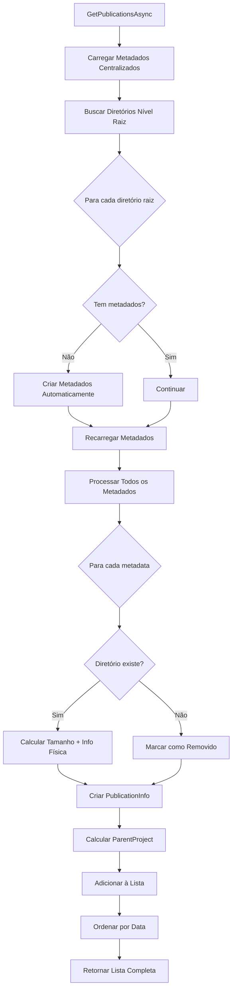

# 📂 Funcionalidade: Busca em Nível Raiz + Metadados Centralizados

## 📋 Visão Geral

Esta funcionalidade redefine a estratégia de listagem de publicações, combinando:
1. **Detecção no nível raiz**: Busca apenas diretórios no primeiro nível da pasta de publicações
2. **Inclusão via metadados**: Lista todos os projetos registrados nos metadados centralizados
3. **Hierarquia via deploy**: Subpastas aparecem apenas quando registradas via processo de deploy

## 🧠 Arquitetura da Solução

### Fontes de Dados

```
📁 Pasta Raiz (Physical)     📄 deploys.json (Metadata)
├── app1/                    ├── { name: "app1", targetPath: "app1" }
├── app2/                    ├── { name: "ecommerce-api", targetPath: "ecommerce/api" }
└── orphan-folder/           ├── { name: "ecommerce-frontend", targetPath: "ecommerce/frontend" }
                            └── { name: "removed-app", targetPath: "old/app", exists: false }

                            RESULTADO FINAL:
                            ├── app1 (parentProject: null, from: physical+metadata)
                            ├── app2 (parentProject: null, from: physical+metadata)  
                            ├── orphan-folder (parentProject: null, from: physical, metadata auto-created)
                            ├── ecommerce-api (parentProject: "ecommerce", from: metadata)
                            ├── ecommerce-frontend (parentProject: "ecommerce", from: metadata)
                            └── removed-app (parentProject: "old", from: metadata, exists: false)
```

### Fluxo de Processamento



## 🛠️ Implementação Técnica

### 1. Método Principal Reestruturado

```csharp
public async Task<List<PublicationInfo>> GetPublicationsAsync()
{
    // 1. Carregar metadados centralizados
    var allDeployMetadata = _deployService.GetAllDeployMetadataWithExistsCheck();
    
    // 2. Buscar apenas diretórios no nível raiz
    var rootDirectories = Directory.GetDirectories(_publicationsPath);
    foreach (var directory in rootDirectories)
    {
        // Criar metadados se não existir
        if (!metadataDict.ContainsKey(fullPath))
        {
            _deployService.CreateMetadataForExistingDirectory(fullPath);
        }
    }
    
    // 3. Recarregar metadados após criações automáticas
    allDeployMetadata = _deployService.GetAllDeployMetadataWithExistsCheck();
    
    // 4. Criar PublicationInfo para TODOS os metadados
    foreach (var metadata in allDeployMetadata)
    {
        // Processar cada entrada dos metadados
        var publication = CreatePublicationFromMetadata(metadata);
        publications.Add(publication);
    }
    
    return publications.OrderByDescending(p => p.LastModified).ToList();
}
```

### 2. Características Técnicas

#### Detecção de Pastas Órfãs
- **Escopo**: Apenas nível raiz
- **Ação**: Criação automática de metadados
- **Resultado**: Pasta aparece na listagem com metadados básicos

#### Processamento de Metadados
- **Fonte**: Arquivo `deploys.json` centralizado
- **Verificação**: Existência física de cada `targetPath`
- **Cálculo**: Tamanho e data de modificação para pastas existentes

#### ParentProject Calculation
- **Baseado em**: `targetPath` dos metadados
- **Lógica**: Primeira parte do caminho se contém separadores
- **Exemplos**: 
  - `"app1"` → `parentProject: null`
  - `"ecommerce/api"` → `parentProject: "ecommerce"`

## 📡 Diferenças vs. Abordagem Anterior

| Aspecto | Abordagem Anterior | Nova Abordagem |
|---------|-------------------|----------------|
| **Busca Física** | Recursiva em todos os níveis | Apenas nível raiz |
| **Subpastas** | Detectadas automaticamente | Apenas via metadados |
| **Performance** | O(n) onde n = total de diretórios | O(r + m) onde r = raiz, m = metadados |
| **Controle** | Todas as pastas aparecem | Subpastas controladas por deploy |
| **Flexibilidade** | Limitada à estrutura física | Estrutura virtual via metadados |

## 🎯 Casos de Uso Suportados

### 1. Apps Tradicionais (Nível Raiz)

**Estrutura Física:**
```
wwwroot/
├── app1/
├── app2/
└── legacy-system/
```

**Resultado:**
- Todos aparecem com `parentProject: null`
- Metadados criados automaticamente se não existir
- Informações físicas (tamanho, data) calculadas

### 2. Microserviços via Deploy

**Deploys Realizados:**
```bash
POST /deploy { targetPath: "microservices/auth" }
POST /deploy { targetPath: "microservices/payment" }
POST /deploy { targetPath: "microservices/user" }
```

**Resultado:**
- Todos aparecem com `parentProject: "microservices"`
- Informações vêm dos metadados
- Pastas físicas podem ou não existir

### 3. Estrutura Híbrida

**Combinação:**
```
Física (raiz):        Metadados (deploys):
├── main-app/    +    ├── main-app (targetPath: "main-app")
├── tools/            ├── services-auth (targetPath: "services/auth")
                      └── services-api (targetPath: "services/api")
```

**Resultado:**
- `main-app`: parentProject: null, existe fisicamente
- `tools`: parentProject: null, pasta órfã detectada
- `services-auth`: parentProject: "services", via deploy
- `services-api`: parentProject: "services", via deploy

## 📊 Response da API

### Exemplo de Resposta Completa

```json
{
  "message": "Publicações listadas com sucesso",
  "count": 6,
  "publications": [
    {
      "name": "main-app",
      "fullPath": "C:\\temp\\wwwroot\\main-app",
      "parentProject": null,
      "exists": true,
      "sizeMB": 45.7,
      "repository": "https://github.com/user/main-app.git",
      "lastModified": "2025-08-02T15:30:00Z"
    },
    {
      "name": "tools",
      "fullPath": "C:\\temp\\wwwroot\\tools", 
      "parentProject": null,
      "exists": true,
      "sizeMB": 12.3,
      "repository": null,
      "lastModified": "2025-08-02T14:20:00Z"
    },
    {
      "name": "services-auth",
      "fullPath": "C:\\temp\\wwwroot\\services\\auth",
      "parentProject": "services",
      "exists": true,
      "sizeMB": 8.9,
      "repository": "https://github.com/user/auth-service.git",
      "lastModified": "2025-08-02T13:45:00Z"
    },
    {
      "name": "services-api",
      "fullPath": "C:\\temp\\wwwroot\\services\\api",
      "parentProject": "services",
      "exists": false,
      "sizeMB": 0,
      "repository": "https://github.com/user/api-service.git",
      "lastModified": "2025-08-01T10:15:00Z"
    }
  ]
}
```

## 🔧 Vantagens da Nova Abordagem

### Performance
- **Busca Não-Recursiva**: Evita percorrer toda árvore de diretórios
- **Processamento Eficiente**: O(r + m) vs O(total_directories)
- **Cache de Metadados**: Carregamento único do arquivo centralizado

### Controle
- **Subpastas Controladas**: Aparecem apenas quando explicitamente deployadas
- **Organização Lógica**: Estrutura reflete decisões de arquitetura, não acidente
- **Deploy Intencional**: Cada subpasta é resultado de processo deliberado

### Flexibilidade
- **Estruturas Virtuais**: Hierarquia independente da estrutura física
- **Multi-Target**: Um deploy pode ir para qualquer subpasta
- **Reorganização**: Mudanças de estrutura via metadados, não filesystem

### Compatibilidade
- **Apps Existentes**: Continuam funcionando (nível raiz)
- **Detecção Automática**: Pastas órfãs são automaticamente incluídas
- **Migração Suave**: Sem breaking changes para apps legados

## 🧪 Cenários de Teste

### Cenário 1: App Tradicional
```
Input: Pasta física "myapp" no nível raiz
Expected: parentProject: null, metadados auto-criados
```

### Cenário 2: Microserviço
```
Input: Deploy com targetPath: "services/auth"
Expected: parentProject: "services", pasta pode não existir fisicamente
```

### Cenário 3: Pasta Órfã
```
Input: Pasta física "tools" sem metadados
Expected: parentProject: null, metadados criados automaticamente
```

### Cenário 4: Projeto Removido
```
Input: Metadados com exists: false
Expected: Nome com "(Removido)", sizeMB: 0, exists: false
```

### Cenário 5: Estrutura Mista
```
Input: Mix de pastas físicas + deploys
Expected: Listagem completa sem duplicação
```

## 🚀 Benefícios para Diferentes Usuários

### Desenvolvedores
- **Flexibilidade**: Deploy para qualquer estrutura de pastas
- **Organização**: Hierarquia lógica independente do filesystem
- **Performance**: Listagem mais rápida, especialmente com muitas pastas

### DevOps
- **Controle**: Subpastas aparecem apenas quando intencionalmente deployadas
- **Monitoramento**: Visão clara de apps ativos vs removidos
- **Cleanup**: Remoção de metadados não afeta detecção de pastas órfãs

### Arquitetos
- **Design Flexible**: Estrutura de deploy independente de limitações físicas
- **Escalabilidade**: Suporte a arquiteturas complexas via metadados
- **Governança**: Controle sobre que componentes são expostos

## 🔄 Migração e Backward Compatibility

### Para Apps Existentes
1. **Nível Raiz**: Continuam funcionando exatamente como antes
2. **Detecção Automática**: Metadados criados automaticamente
3. **Zero Downtime**: Nenhuma interrupção necessária

### Para Estruturas Complexas
1. **Deploy Explícito**: Subpastas precisam ser deployadas explicitamente
2. **Metadados Manuais**: Ou criação manual de entradas nos metadados
3. **Gradual**: Migração pode ser feita progressivamente

---

**📝 Nota:** Esta abordagem equilibra performance, controle e flexibilidade, fornecendo uma base sólida para growth futuro enquanto mantém total compatibilidade com deployments existentes.
